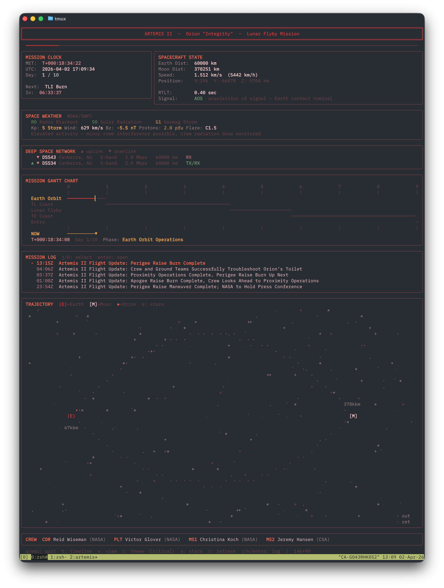

# Artemis II Mission Dashboard

A real-time terminal dashboard for tracking NASA's [Artemis II](https://www.nasa.gov/humans-in-space/artemis/) crewed lunar flyby mission, built with Go and [Bubble Tea](https://github.com/charmbracelet/bubbletea).



## Live Data Sources

- **Deep Space Network** -- real-time antenna tracking, signal status, and range via [DSN Now](https://eyes.nasa.gov/dsn/data/dsn.xml)
- **JPL Horizons** -- spacecraft position, velocity, and Earth/Moon distance via the [Horizons API](https://ssd.jpl.nasa.gov/api/horizons.api) (spacecraft ID `-1024`)
- **NOAA SWPC** -- space weather conditions (Kp index, solar wind, Bz, proton flux, flare class) via [SWPC services](https://services.swpc.noaa.gov)
- **NASA Blog** -- mission log entries from the [Artemis blog](https://www.nasa.gov/wp-json/wp/v2/nasa-blog?categories=2918) WordPress REST API

## Requirements

- Go 1.22+
- A terminal emulator with 256-color support (most modern terminals)
- Minimum terminal size: 60 columns x 14 rows (more space shows more panels)

## Build and Run

```sh
go build -o artemis ./main.go
./artemis
```

Or run directly:

```sh
go run main.go
```

## Keybindings

| Key | Action |
|-----|--------|
| `q` / `Esc` | Quit |
| `t` | Toggle between Gantt chart and event timeline |
| `c` | Cycle color theme (Default, Retro, Hi-Con, Critical) |
| `s` | Toggle star animation in trajectory view |
| `r` | Force-refresh all data sources |
| `j` / `Tab` | Select next mission log entry |
| `k` / `Shift+Tab` | Select previous mission log entry |
| `Enter` | Open selected log entry in browser |

## Panels

The dashboard shows panels based on available terminal height, in priority order:

1. **Mission Clock** -- MET, UTC time, mission day, next event countdown
2. **Spacecraft State** -- distance from Earth/Moon, speed, position vector, RTLT, AOS/LOS signal status
3. **Space Weather** -- NOAA R/S/G scales, Kp index, solar wind, Bz, proton flux
4. **Deep Space Network** -- active dishes, signal bands, data rates, range
5. **Mission Timeline** -- Gantt chart or scrolling event list with 25 mission events
6. **Mission Log** -- latest NASA blog posts with selection and browser opening
7. **Trajectory** -- ASCII art Earth-to-Moon trajectory with twinkling stars and pulsing spacecraft (turns red during LOS)
8. **Crew** -- the four [Artemis II astronauts](https://www.nasa.gov/feature/our-artemis-crew/) and their roles

## Data Refresh Rates

Polling intervals are tuned for long-running sessions to minimize battery and network usage:

| Source | Interval |
|--------|----------|
| Deep Space Network | 30 seconds |
| JPL Horizons | 5 minutes |
| Space Weather | 5 minutes |
| NASA Blog | 1 hour |

Press `r` at any time to force an immediate refresh of all sources.

## Color Themes

Cycle through four themes with `c`:

- **Default** -- blue/green on dark background
- **Retro** -- amber/green phosphor terminal
- **Hi-Con** -- high-contrast white/green/yellow
- **Critical** -- dark red mission-critical aesthetic
